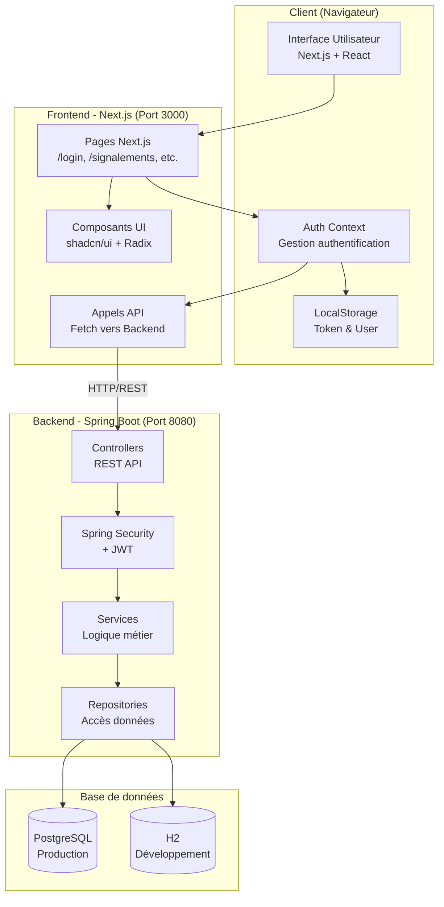
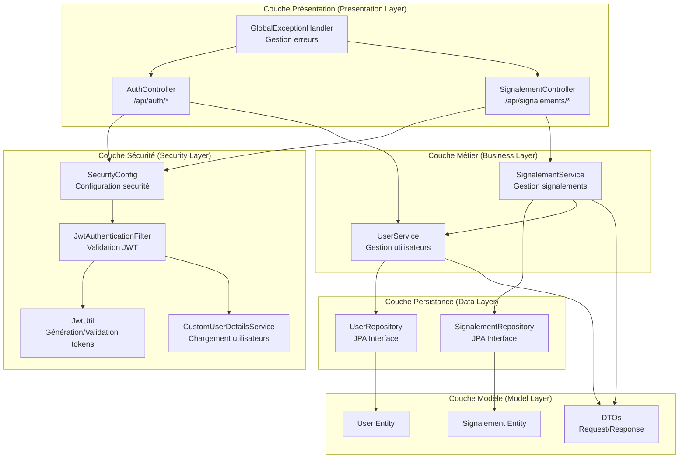
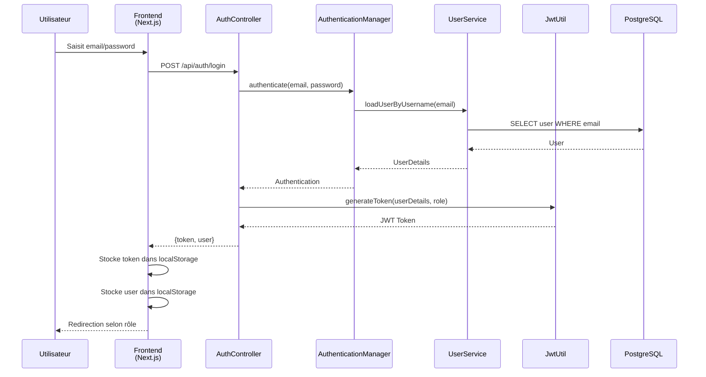
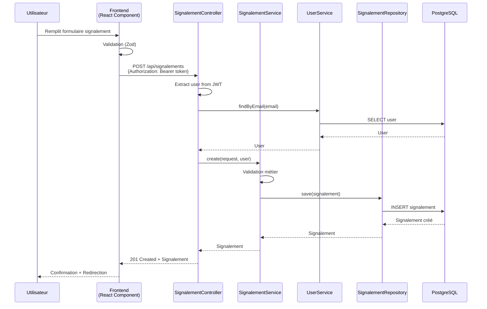
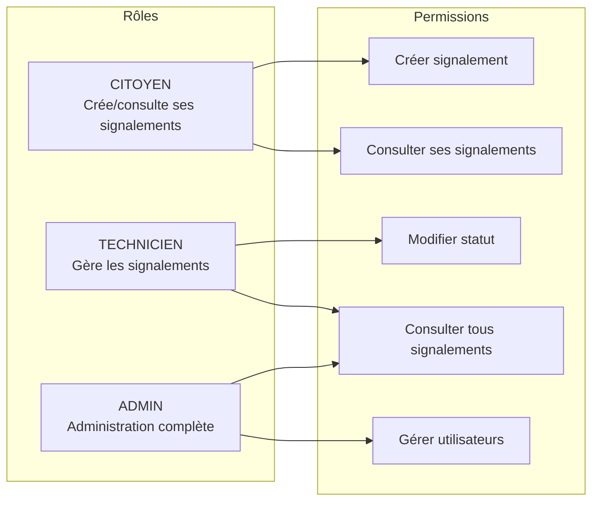
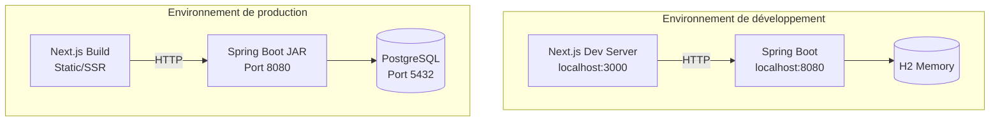

# Architecture Logicielle - Urban Reporting

Ce document présente l'architecture logicielle du système de signalement urbain.

## Vue d'ensemble de l'architecture



## Architecture en couches du Backend



## Flux d'authentification



## Flux de création d'un signalement



## Structure du Frontend

```mermaid
graph LR
    subgraph "Pages Next.js"
        Home[page.tsx<br/>Accueil]
        Login[login/page.tsx]
        Register[inscription/page.tsx]
        SignalList[signalements/page.tsx]
        SignalNew[signalements/nouveau/page.tsx]
        SignalDetail[signalements/[id]/page.tsx]
        MesSignals[mes-signalements/page.tsx]
        AdminDash[admin/dashboard/page.tsx]
        TechDash[technicien/dashboard/page.tsx]
    end

    subgraph "Composants UI"
        UI[components/ui/<br/>Button, Card, Form, etc.]
        Layout[components/<br/>Header, Footer, etc.]
    end

    subgraph "Logique Métier"
        AuthContext[lib/auth-context.tsx<br/>Gestion authentification]
        Utils[lib/utils.ts<br/>Utilitaires]
    end

    subgraph "Styling"
        Tailwind[Tailwind CSS<br/>Styling]
        GlobalCSS[globals.css]
    end

    Home --> UI
    Login --> AuthContext
    Login --> UI
    Register --> AuthContext
    Register --> UI
    SignalList --> UI
    SignalNew --> UI
    SignalNew --> AuthContext
    SignalDetail --> UI
    MesSignals --> AuthContext
    MesSignals --> UI
    AdminDash --> AuthContext
    TechDash --> AuthContext
    UI --> Tailwind
    Layout --> UI
```

## Stack technologique détaillée

### Frontend
- **Framework**: Next.js 16.0.10 (React 19.2.0)
- **Langage**: TypeScript 5
- **Styling**: Tailwind CSS 4.1.9
- **UI Components**: Radix UI + shadcn/ui
- **Formulaires**: React Hook Form + Zod
- **Cartes**: Leaflet + React Leaflet
- **Gestion d'état**: React Context API
- **Stockage local**: LocalStorage
- **Build**: Next.js (Webpack/Turbopack)

### Backend
- **Framework**: Spring Boot 3.4.0
- **Langage**: Java 21
- **Sécurité**: Spring Security + JWT (jjwt 0.12.3)
- **ORM**: Spring Data JPA + Hibernate
- **Build**: Maven
- **Outils**: Lombok (réduction boilerplate)
- **Validation**: Spring Boot Validation
- **API**: REST

### Base de données
- **Production**: PostgreSQL
  - Port: 5432
  - Base: cityreport
  - Pool: HikariCP (10 connexions max)
- **Développement**: H2 (optionnel)
  - En mémoire
  - Console: /h2-console

### Communication
- **Protocol**: HTTP/HTTPS
- **Format**: JSON
- **CORS**: Configuré pour localhost:3000 et localhost:3001
- **Authentification**: Bearer Token (JWT)

## Endpoints API principaux

### Authentification
- `POST /api/auth/register` - Inscription
- `POST /api/auth/login` - Connexion

### Signalements
- `GET /api/signalements/public` - Liste publique (sans auth)
- `GET /api/signalements` - Liste complète (auth requise)
- `GET /api/signalements/mes-signalements` - Mes signalements (citoyen)
- `GET /api/signalements/{id}` - Détails d'un signalement
- `POST /api/signalements` - Créer un signalement
- `PATCH /api/signalements/{id}/statut` - Mettre à jour le statut
- `DELETE /api/signalements/{id}` - Supprimer un signalement

## Rôles utilisateurs



## Déploiement



## Sécurité

- **Authentification**: JWT (JSON Web Tokens)
- **Expiration token**: 86400000ms (24h)
- **Validation**: Spring Security + JwtAuthenticationFilter
- **CORS**: Configuration restrictive
- **Validation données**: Bean Validation (Jakarta)
- **Mot de passe**: Encodage via Spring Security BCrypt


